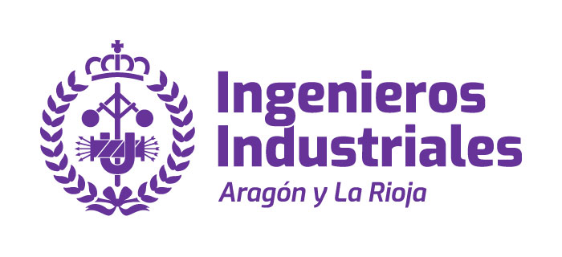
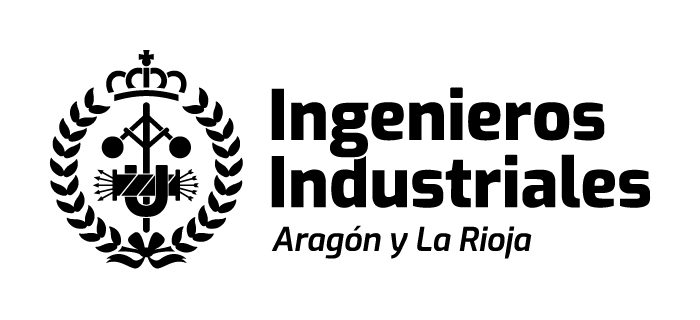
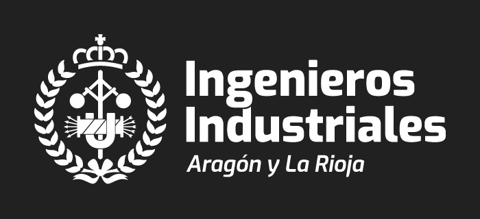
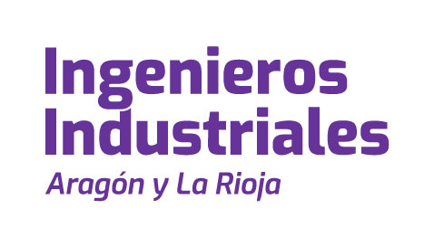
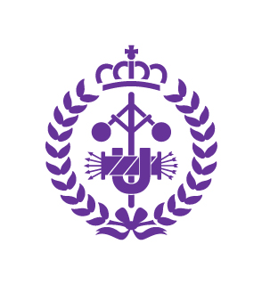

Hemos rediseñado nuestra identidad corporativa. Dotando a nuestra marca de frescura coherencia y un aire mucho mas actual.

Nuestra marca está compuesta por dos elementos principales: **logotipo e isotipo**, estos dos elementos componen nuestra marca o **imagotipo**.

En este apartado aprenderemos a usarlos correctamente.

### Imagotipo

El imagotipo es la versión idónea para todas las comunicaciones, un componente clave y una de las partes más visibles de nuestra identidad.

    

      <strong>Positivo</strong>
      
    

    

        <strong>Negativo</strong>
        
    

### Logotipo

El logotipo es la versión idónea para comunicaciones donde el espacio sea reducido o en tamaños pequeños.

### Isotipo o escudo

Nuestro escudo tiene una larga trayectoria (consulta la [sección historia](./historia)) y lo hemos rediseñado para aplicarlo en iconos, favicon y como recurso gráfico.
