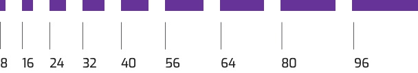

Nuestros sistema de layout está basado en uan escala de espaciados basada en múltiplos de 8.

Compuesto por una retícula de hasta **12 columas con 1.25rem/24px** se separación entre ellas, el ancho estándar para nuestros productos
digitales será de **72rem/1128px**. Puedes consultar la web de [Flexbox Grid](http://flexboxgrid.com/) para saber más acerca del grid.


### Grid

<div class="row">
    <div class="col-xs-12 col-md-1"><div class="box-row">1</div></div>
    <div class="col-xs-12 col-md-1">
        <div class="box-row">1</div>
    </div>
    <div class="col-xs-12 col-md-1">
        <div class="box-row">1</div>
    </div>
    <div class="col-xs-12 col-md-1">
        <div class="box-row">1</div>
    </div>
    <div class="col-xs-12 col-md-1">
        <div class="box-row">1</div>
    </div>
    <div class="col-xs-12 col-md-1">
        <div class="box-row">1</div>
    </div>
    <div class="col-xs-12 col-md-1">
        <div class="box-row">1</div>
    </div>
    <div class="col-xs-12 col-md-1">
        <div class="box-row">1</div>
    </div>
    <div class="col-xs-12 col-md-1">
        <div class="box-row">1</div>
    </div>
    <div class="col-xs-12 col-md-1">
        <div class="box-row">1</div>
    </div>
    <div class="col-xs-12 col-md-1">
        <div class="box-row">1</div>
    </div>
    <div class="col-xs-12 col-md-1">
        <div class="box-row">1</div>
    </div>
</div>

<div class="row">
    <div class="col-xs-12 col-md-2">
        <div class="box-row">2</div>
    </div>
    <div class="col-xs-12 col-md-2">
        <div class="box-row">2</div>
    </div>
    <div class="col-xs-12 col-md-2">
        <div class="box-row">2</div>
    </div>
    <div class="col-xs-12 col-md-2">
        <div class="box-row">2</div>
    </div>
    <div class="col-xs-12 col-md-2">
        <div class="box-row">2</div>
    </div>
    <div class="col-xs-12 col-md-2">
        <div class="box-row">2</div>
    </div>
</div>

<div class="row">
    <div class="col-xs-12 col-md-3">
        <div class="box-row">3</div>
    </div>
    <div class="col-xs-12 col-md-3">
        <div class="box-row">3</div>
    </div>
    <div class="col-xs-12 col-md-3">
        <div class="box-row">3</div>
    </div>
    <div class="col-xs-12 col-md-3">
        <div class="box-row">3</div>
    </div>
</div>

<div class="row">
    <div class="col-xs-12 col-md-4">
        <div class="box-row">4</div>
    </div>
    <div class="col-xs-12 col-md-4">
        <div class="box-row">4</div>
    </div>
    <div class="col-xs-12 col-md-4">
        <div class="box-row">4</div>
    </div>
</div>

<div class="row">
    <div class="col-xs-12 col-md-5">
        <div class="box-row">5</div>
    </div>
    <div class="col-xs-12 col-md-5">
        <div class="box-row">5</div>
    </div>
    <div class="col-xs-12 col-md-2">
        <div class="box-row">2</div>
    </div>
</div>

<div class="row">
    <div class="col-xs-6 col-md-6">
        <div class="box-row">6</div>
    </div>
    <div class="col-xs-6 col-md-6">
        <div class="box-row">6</div>
    </div>
</div>

<div class="row">
    <div class="col-xs-6 col-md-7">
        <div class="box-row">7</div>
    </div>
    <div class="col-xs-6 col-md-5">
        <div class="box-row">5</div>
    </div>
</div>

<div class="row">
    <div class="col-xs-6 col-md-8">
        <div class="box-row">8</div>
    </div>
    <div class="col-xs-6 col-md-4">
        <div class="box-row">4</div>
    </div>
</div>

<div class="row">
    <div class="col-xs-6 col-md-9">
        <div class="box-row">9</div>
    </div>
    <div class="col-xs-6 col-md-3">
        <div class="box-row">3</div>
    </div>
</div>

<div class="row">
    <div class="col-xs-6 col-md-10">
        <div class="box-row">10</div>
    </div>
    <div class="col-xs-6 col-md-2">
        <div class="box-row">2</div>
    </div>
</div>

<div class="row">
    <div class="col-xs-6 col-md-11">
        <div class="box-row">11</div>
    </div>
    <div class="col-xs-6 col-md-1">
        <div class="box-row">1</div>
    </div>
</div>

<div class="row">
    <div class="col-xs-12">
        <div class="box-row">12</div>
    </div>
</div>

Ejemplo de columnas en html

```html
<div class="row">
    <div class="col-xs-12 col-md-3">
        <div class="box-row">3</div>
    </div>
    <div class="col-xs-12 col-md-3">
        <div class="box-row">3</div>
    </div>
    <div class="col-xs-12 col-md-3">
        <div class="box-row">3</div>
    </div>
    <div class="col-xs-12 col-md-3">
        <div class="box-row">3</div>
    </div>
</div>

<div class="row">
    <div class="col-xs-12 col-md-4">
        <div class="box-row">4</div>
    </div>
    <div class="col-xs-12 col-md-4">
        <div class="box-row">4</div>
    </div>
    <div class="col-xs-12 col-md-4">
        <div class="box-row">4</div>
    </div>
</div>

<div class="row">
    <div class="col-xs-6 col-md-6">
        <div class="box-row">6</div>
    </div>
    <div class="col-xs-6 col-md-6">
        <div class="box-row">6</div>
    </div>
</div>

<div class="row">
    <div class="col-xs-12">
        <div class="box-row">12</div>
    </div>
</div>

```                    

### Espaciado

Establecemos un valor base de 16px o 1rem. Siempre usando nuestra escala de espaciados basada en múltilos de 8.



Variables sass para los espacios

```sass
/* set base value. You can change this value */
$space__unit: 1rem;

/* space scale */
$space-xxs: calc(0.5 * #{$space__unit}); // 8px
$space-xs: calc(1.5 * #{$space__unit}); // 24px
$space-sm: calc(2 * #{$space__unit}); // 32px
$space-md: calc(2.5 * #{$space__unit}); // 40px
$space-lg: calc(3.5 * #{$space__unit}); // 56px
$space-xl: calc(4 * #{$space__unit}); // 64px
$space-xxl: calc(6 * #{$space__unit}); // 80px
$space-xxxl: calc(8 * #{$space__unit}); // 96px

```